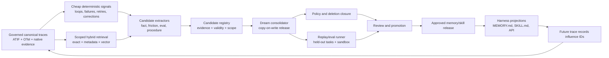

# Dreaming, memory-palace, and self-evolving-skill review

**Status:** architecture and experimental-design review
**Reviewed:** 2026-07-30
**Scope:** Anthropic Dreams, OpenAI dreaming, the two distinct “Memory Palace”
projects, Hermes Agent, Hermes Agent Self-Evolution, Graphiti, LangMem,
ReasoningBank, and closely related skill-learning systems

## Decision

Frankengate should not adopt any one of these projects as its memory or
self-improvement subsystem.

The useful design is a governed composition of mechanisms:

1. keep the canonical, authorization-scoped trace as immutable evidence;
2. retrieve verbatim evidence before asking a model to summarize it;
3. extract facts, preferences, lessons, and procedures into **candidates**, never
   directly into live memory;
4. preserve validity time, contradiction, applicability, and exact source-event
   links;
5. consolidate candidates into a copy-on-write “dream release”;
6. replay proposed skills on held-out, executable tasks;
7. promote a release only after policy, evidence, deletion, contamination, and
   outcome gates pass; and
8. render an approved release into `MEMORY.md`, `SKILL.md`, or another
   harness-specific format at the edge. Those files are delivery artifacts, not
   the system of record.

The smallest plausible production architecture is still Frankengate plus its
governed PostgreSQL/Aurora evidence store, an asynchronous analysis worker, and
an isolated replay runner. MemPalace, Graphiti, LangMem, ReasoningBank, GEPA,
EvoSkill, and Hermes should initially be experimental arms or sources of
mechanisms. None justifies another production database by itself.

The most important missing feature in existing open-source systems is not a
better vector index. It is a **governed evidence-to-candidate-to-release
protocol**. Existing systems usually optimize one part of the loop while
omitting authorization, provenance, temporal truth, deletion propagation,
independent evaluation, or rollback.

## Source resolution and reproducibility pins

“Memory Palace” names two materially different projects. Both are reviewed so
that their mechanisms are not accidentally conflated.

| Name in this review | Exact source | Pin | Release status |
|---|---|---:|---|
| Anthropic Dreams | [Claude Platform Dreams](https://platform.claude.com/docs/en/managed-agents/dreams) | API beta `dreaming-2026-04-21` | Managed research preview; no OSS source |
| OpenAI dreaming | [Dreaming: Better memory for a more helpful ChatGPT](https://openai.com/index/chatgpt-memory-dreaming/) | Product post, 2026-06-04 | Managed product description; no OSS source |
| Hermes Agent | [hermes-agent-org/hermes](https://github.com/hermes-agent-org/hermes) | [`v0.1.0` / `37d6873`](https://github.com/hermes-agent-org/hermes/tree/37d68738f4dd265ffb1201d953fd395350dd96a2) | Latest GitHub release found |
| Hermes Agent Self-Evolution | [NousResearch/hermes-agent-self-evolution](https://github.com/NousResearch/hermes-agent-self-evolution) | [`0a929e3`](https://github.com/NousResearch/hermes-agent-self-evolution/tree/0a929e3aa20e15cf04dc7c28492a7d41a5139125) | No tag or GitHub release; pinned `main` |
| MemPalace | [MemPalace/mempalace](https://github.com/MemPalace/mempalace) | [`v3.6.0` / `8ab251c`](https://github.com/MemPalace/mempalace/tree/8ab251c452c43f2b07a76a28f2433e258307f571) | Latest release found, 2026-07-17 |
| Memory Palace | [jeffpierce/memory-palace](https://github.com/jeffpierce/memory-palace) | [`v2.0.1` / `fd88282`](https://github.com/jeffpierce/memory-palace/tree/fd88282c1e2404d35d284dd09f622b4c1ec9b506) | Latest release found, 2026-02-10 |
| Graphiti | [getzep/graphiti](https://github.com/getzep/graphiti) | [`v0.29.3` / `021d3a5`](https://github.com/getzep/graphiti/tree/021d3a57d511f21b10adaf7fa923bd5c1fce5e9d) | Latest release reviewed elsewhere in this roadmap |
| LangMem | [langchain-ai/langmem](https://github.com/langchain-ai/langmem) | [`56d8593`, package 0.0.30](https://github.com/langchain-ai/langmem/tree/56d85939d80bb731bd5e237567148d817d7bfd16) | No repository tag or release |
| ReasoningBank | [google-research/reasoning-bank](https://github.com/google-research/reasoning-bank) | [`ed80611`, package 0.1.0](https://github.com/google-research/reasoning-bank/tree/ed80611788292ea739f1effd31f16c53823b8a0d) | No repository tag or release |
| EvoSkill | [sentient-agi/EvoSkill](https://github.com/sentient-agi/EvoSkill) | [`v1.3.0` / `1d7dc3e`](https://github.com/sentient-agi/EvoSkill/tree/1d7dc3e6d204473c541f63eea2c99fb7f7eba3fd) | Latest release found |
| AutoSkill | [ECNU-ICALK/AutoSkill](https://github.com/ECNU-ICALK/AutoSkill) | [`94c47ca`](https://github.com/ECNU-ICALK/AutoSkill/tree/94c47ca488d4ba4117d20272e66d49b9877e68cf) | No GitHub release found |
| GEPA / `gskill` | [gepa-ai/gepa](https://github.com/gepa-ai/gepa) | [`v0.1.4` / `8b0ce6c`](https://github.com/gepa-ai/gepa/tree/8b0ce6cd99a234f6b74daf37558a2ac0ce18f975) | Latest release found |
| Memento-Skills | [Memento-Teams/Memento-Skills](https://github.com/Memento-Teams/Memento-Skills) | [`v0.3.8` / `e7687d9`](https://github.com/Memento-Teams/Memento-Skills/tree/e7687d9c14b87c424d39498a1e8e91afd7c57d9f) | Latest release found |

### “Jeopard” remains unresolved

No exact current repository or paper named “Jeopard” that learns and improves
agent skills from trajectories could be identified through GitHub and paper
search. It may be a phonetic reference to GEPA, a project with a different
spelling, or a private project. This review does not silently assign the name.

For the requested “or similar” comparison, the closest reproducible mechanisms
are:

- [`gskill`](https://gepa-ai.github.io/gepa/guides/gskill/), which generates
  verifiable repository tasks and evolves a text skill with GEPA;
- [EvoSkill](https://arxiv.org/abs/2603.02766), which proposes mutations from
  failures and retains programs on a held-out Pareto frontier;
- [AutoSkill](https://arxiv.org/abs/2603.01145), which creates, improves,
  merges, or discards skills from interaction history;
- [Memento-Skills](https://arxiv.org/abs/2603.18743), which treats structured
  Markdown skills as persistent state and learns both routing and updates; and
- [CODESKILL](https://arxiv.org/abs/2605.25430), which learns a skill-management
  policy with rubric and verifiable execution rewards.

The intended “Jeopard” project should be confirmed before any result is
attributed to it.

## What each system actually stores and updates

| System | Input | Durable artifact | Update/consolidation loop | Useful mechanism | Critical gap for enterprise traces |
|---|---|---|---|---|---|
| Anthropic Dreams | One existing Anthropic memory store plus 1–100 Anthropic Managed Agent sessions | A separate Anthropic memory store | Asynchronous dedupe, stale/contradicted replacement, reorganization, insight synthesis; user reviews output | Copy-on-write consolidation and explicit review/discard | Cannot ingest arbitrary ATIF/OTel traces; black-box extraction; no public evidence schema, replay, RLS, or reproducible algorithm |
| OpenAI dreaming | Chat history and existing ChatGPT memory | User-visible memory summary | Background refresh for usefulness, preference adherence, and currentness | Freshness as a first-class objective and an editable summary | Product description, not an API or OSS baseline; no public artifact contract or evaluator |
| Hermes Agent | Conversation history, session transcripts, tool use | `MEMORY.md`, `USER.md`, skill folders, ShareGPT-like JSONL | Live nudges plus hidden background reviewer write directly to shared files | Separation of declarative memory, episodic search, and procedural skills; compact memory budget | Direct mutation, weak provenance, no candidate release, no independent replay, no enterprise scope |
| Hermes Self-Evolution | Synthetic, golden, or mined task examples plus a skill | Baseline/evolved Markdown and metrics JSON | DSPy GEPA/MIPRO optimization, constraints, holdout scoring | Useful intended scaffold for artifact evolution | Reviewed implementation optimizes keyword overlap, does not mutate the actual skill body, and omits claimed test/benchmark/PR gates |
| MemPalace | Files and conversations | Verbatim drawers/closets, vectors, metadata, optional temporal triples | Mine/index/search; optional hierarchy and temporal KG | Strong verbatim evidence baseline, deterministic IDs, temporal provenance fields, retrieval benchmark honesty | Palace hierarchy is metadata, not governance; pgvector backend has no RLS; lexical path scans rows in Python; not a trajectory learner |
| `jeffpierce/memory-palace` | Transcript text or direct memories | Typed memory rows, embeddings, relationship edges | LLM reflection writes extracted records; similarity and graph-centrality retrieval | Explicit relation types, local extraction, source session, dry-run | Optional scope filters, direct writes, truncated transcripts, fragile parser, popularity feedback, no evidence spans or release gate |
| LangMem | Chat messages and optional existing memories | Pydantic-typed extracted memories; optional store mutations | Insert/update/delete through a schema-guided manager | Small stateless structured extraction arm | Default artifact lacks exact evidence, sensitivity, validity, and authority; store namespace is not RLS |
| Graphiti | Time-referenced text/JSON episodes | Entities, fact edges, episode lineage, validity intervals | LLM extraction, entity resolution, contradiction/invalidation, hybrid search | Temporal fact and provenance experiment | Graph `group_id` is not authorization; multi-service stochastic pipeline; graph database adds operational surface |
| ReasoningBank | Task, observable trajectory, and success/failure | General lessons indexed by task | Induce a few lessons, retrieve for a later task, observe outcome | Outcome-conditioned success/failure contrast | Released runners are benchmark-specific; unsafe artifact readers; self-evaluation and self-retrieval can contaminate results |
| GEPA / `gskill` | Generated executable tasks, rollouts, fitness feedback | Evolved textual skill | Reflective proposal and selection over train/validation tasks | Verifiable task generation and held-out text evolution | A repository test is not an enterprise truth label; synthetic-task distribution can overfit |
| EvoSkill | Failed executions and validation tasks | Versioned agent programs and skill folders | Propose, generate, evaluate, retain a Pareto frontier | Immutable variants and held-out program selection | Coding/task benchmarks do not supply user consent, classification, temporal facts, or organizational policy |
| AutoSkill / Memento / CODESKILL | Interaction trajectories and task outcomes | Skill bank, router/policy, or stateful prompt | Create/merge/improve/prune; sometimes learn router or manager with RL | Treat skill selection and maintenance as learnable, not fixed heuristics | Learned managers can optimize proxy reward, amplify biased history, and erase minority-but-critical procedures |

These systems work together only if every reduced artifact retains its type.
A model-inferred fact is not an observed event; a lesson is not a policy; a
successful trajectory is not proof that every step was correct; and a
frequently retrieved memory is not necessarily important.

## Anthropic Dreams and what an OSS implementation is missing

The documented Dreams contract has several unusually good properties:

- the input memory store is never modified;
- selected sessions are explicit and bounded;
- the result is a separate output store;
- the job is asynchronous and inspectable;
- failed or canceled jobs can leave a partial output that must not be mistaken
  for a release; and
- the user decides whether to attach or discard the result.

The service also documents deduplication, replacing stale or contradicted
content with newer information, and surfacing higher-level insights. Anthropic’s
[Managed Agents announcement](https://claude.com/blog/new-in-claude-managed-agents)
describes recurring mistakes and converged workflows as target discoveries.
Those are product claims, not a published algorithm or independent benchmark.

OpenAI’s description adds a useful separate idea: evaluate memory on whether it
carries useful context, obeys preferences and constraints, and remains current.
It also says earlier dreaming was insufficient as a standalone memory system.
Frankengate should keep those as distinct eval dimensions rather than collapse
them into one judge score.

### Required OSS contract

An OSS “dream” should be a deterministic, auditable job envelope around a
potentially stochastic model:

```text
DreamJob
  input_release_id
  trace_manifest[]              # immutable trace/event hashes
  principal_scope               # user, team, enterprise
  authorization_snapshot_id
  authorization_epoch
  policy_snapshot_id
  classification_ceiling
  model, prompt, extractor_version
  random_seed and decoding params
  requested_operations[]        # dedupe, contradict, infer, compact, propose-skill
  status

DreamCandidate
  kind                          # fact, preference, procedure, friction, eval, relation
  statement
  evidence_event_ids[]
  evidence_quotes_or_structured_fields[]
  observed_at
  valid_from, valid_to
  system_from, system_to
  applicability
  confidence
  sensitivity
  inference_method
  contradiction_set_id
  proposed_action               # add, supersede, retain-both, expire, reject

DreamRelease
  parent_release_id
  candidate_ids[]
  evidence_coverage
  eval_run_ids[]
  policy_result
  deletion_closure_result
  reviewer_decision
  promoted_at
  rollback_of?
```

The OSS implementation must add capabilities that the public managed contract
does not expose:

1. **Native trace input.** Read canonical ATIF/OTel/native events without
   serializing a trace into one synthetic user message.
2. **Evidence-preserving extraction.** Every claim names exact source events and
   structured fields. Unsupported “insights” remain hypotheses.
3. **Bitemporal truth.** “Latest wins” is unsafe when facts differ by project,
   environment, jurisdiction, or user. Preserve valid time and system time, and
   retain context-specific contradictions.
4. **Authorization closure.** A candidate may be no more visible than the
   intersection of its evidence. Retrieval and consolidation both run under a
   policy and authorization-epoch snapshot.
5. **Deletion closure.** Deleting or reclassifying evidence invalidates derived
   candidates, embeddings, graph edges, releases, exports, and cached answers.
6. **Candidate isolation.** A model never writes directly to live memory,
   skills, policy, routing, or user-visible recommendations.
7. **Independent validation.** Memory claims need evidence checks; procedural
   skills need held-out execution; recommendations need calibrated human
   feedback.
8. **Diff, review, and rollback.** Show additions, removals, supersessions,
   merged candidates, evidence, and expected downstream effects.
9. **Partial-job safety.** Incomplete, failed, or canceled jobs can be inspected
   but never promoted.
10. **Reproducibility.** Pin code, model, prompt, schema, tool versions, and
    source hashes for every run.
11. **Harness delivery.** Render approved views to `MEMORY.md`, `SKILL.md`, or
    an API at read time; do not make those mutable files authoritative.
12. **Influence logging.** Future traces record which release and candidate IDs
    influenced the agent, enabling benefit, harm, and contamination analysis.

This is the open-source gap worth building. Recreating an opaque background
summary job without this protocol would reproduce the least important part of
Dreams.

## The two Memory Palace projects

### MemPalace: a strong evidence-retrieval baseline, not a learning engine

MemPalace’s most valuable hypothesis is simple: preserve conversations verbatim
and establish the retrieval baseline before extracting summaries. Its own
[benchmark notes](https://github.com/MemPalace/mempalace/blob/8ab251c452c43f2b07a76a28f2433e258307f571/benchmarks/BENCHMARKS.md#L42-L94)
correctly warn that retrieval recall and end-to-end answer accuracy are not
comparable and disclose that the final improvement to a perfect result was tuned
on three known failures. The documented baseline stores each session verbatim,
then adds lexical and temporal signals
([source](https://github.com/MemPalace/mempalace/blob/8ab251c452c43f2b07a76a28f2433e258307f571/benchmarks/BENCHMARKS.md#L200-L239)).

Its default embedding is `all-MiniLM-L6-v2`; the alternative is a
384-dimensional truncation of EmbeddingGemma, and switching spaces requires an
index rebuild
([source](https://github.com/MemPalace/mempalace/blob/8ab251c452c43f2b07a76a28f2433e258307f571/mempalace/embedding.py#L6-L17)).
This reinforces the need to treat embeddings as rebuildable derivatives, not
records of truth.

The pgvector backend stores text, JSONB metadata, and a vector
([schema](https://github.com/MemPalace/mempalace/blob/8ab251c452c43f2b07a76a28f2433e258307f571/mempalace/backends/pgvector.py#L596-L606)).
Its isolation contract is one generated table per namespace, palace, and
collection, not database-enforced RLS
([source](https://github.com/MemPalace/mempalace/blob/8ab251c452c43f2b07a76a28f2433e258307f571/mempalace/backends/pgvector.py#L14-L17)).
Its lexical search scrolls rows and computes BM25 in Python
([source](https://github.com/MemPalace/mempalace/blob/8ab251c452c43f2b07a76a28f2433e258307f571/mempalace/backends/pgvector.py#L1197-L1214)).
That is not suitable as the enterprise lexical path.

The optional local SQLite knowledge graph is more interesting. It records
`valid_from`, `valid_to`, confidence, and closet/file/drawer/adapter provenance
([schema](https://github.com/MemPalace/mempalace/blob/8ab251c452c43f2b07a76a28f2433e258307f571/mempalace/knowledge_graph.py#L150-L184))
and uses half-open validity intervals
([source](https://github.com/MemPalace/mempalace/blob/8ab251c452c43f2b07a76a28f2433e258307f571/mempalace/knowledge_graph.py#L106-L134)).
Frankengate should test those temporal/provenance semantics in PostgreSQL,
without adopting the separate SQLite graph.

The stable release is also not a production-governance substrate. Recent open
issues report a read-only path that still writes configuration
([#2101](https://github.com/MemPalace/mempalace/issues/2101)), a `--dry-run`
repair path that performs a real rebuild
([#2095](https://github.com/MemPalace/mempalace/issues/2095)), lost drawer
provenance in search
([#2080](https://github.com/MemPalace/mempalace/issues/2080)), duplicate message
IDs dropping a whole transcript
([#2112](https://github.com/MemPalace/mempalace/issues/2112)), and an entity
regex that can backtrack catastrophically
([#2063](https://github.com/MemPalace/mempalace/issues/2063)). These do not erase
the useful retrieval concepts; they do rule out treating v3.6.0 as an authority
or ingestion service.

What Frankengate should take:

- verbatim evidence as the first baseline;
- exact plus semantic hybrid retrieval;
- deterministic chunk IDs and rebuildable indexes;
- provenance pointers from reduced artifacts to full evidence;
- temporal validity and explicit invalidation;
- benchmark separation between retrieval, answer quality, and downstream task
  outcome; and
- corruption/rebuild tests.

What it should not take:

- spatial “wing/room/drawer” names as a required data model;
- a table-per-scope authorization model;
- Python-side full-table lexical ranking;
- a second SQLite graph;
- a fixed generic embedding as evidence that domain retrieval is solved; or
- retrieval recall as evidence that memory improves agent behavior.

### `jeffpierce/memory-palace`: typed reflection plus graph retrieval

This project takes a different path. It extracts typed, standalone summaries
from a transcript and stores a memory with `instance_id`, projects, type,
subject, content, keywords, tags, source session, embedding, access count,
expiration, and archive status
([schema](https://github.com/jeffpierce/memory-palace/blob/fd88282c1e2404d35d284dd09f622b4c1ec9b506/memory_palace/models_v3.py#L78-L138)).
It also models relationships such as derivation, contradiction, refinement, and
supersession.

The reflection path truncates the transcript at 65,000 characters, asks an LLM
for pipe-delimited `M|TYPE|SUBJECT|CONTENT` lines, marks several model-selected
types as foundational, and writes them directly to the database
([source](https://github.com/jeffpierce/memory-palace/blob/fd88282c1e2404d35d284dd09f622b4c1ec9b506/memory_palace/services/reflection_service.py#L19-L150)).
It records a session ID but not exact evidence spans. A second reflection
implementation exists in the memory service; when no session ID is supplied its
embedding query can select all unembedded records
([source](https://github.com/jeffpierce/memory-palace/blob/fd88282c1e2404d35d284dd09f622b4c1ec9b506/memory_palace/services/memory_service.py#L1575-L1680)).

Retrieval scope filters are optional
([source](https://github.com/jeffpierce/memory-palace/blob/fd88282c1e2404d35d284dd09f622b4c1ec9b506/memory_palace/services/memory_service.py#L625-L709)).
Results are reranked using semantic similarity, access frequency, and graph
centrality, then every retrieval increments access count
([source](https://github.com/jeffpierce/memory-palace/blob/fd88282c1e2404d35d284dd09f622b4c1ec9b506/memory_palace/services/memory_service.py#L718-L874)).
This creates a self-reinforcing popularity loop: an early false or broad memory
can be retrieved more, gain access weight, and crowd out rare but decisive
evidence.

What Frankengate should take:

- typed memory categories;
- explicit contradiction, derivation, refinement, and supersession edges;
- source-session linkage;
- extraction dry-run and graph-context experiments; and
- expiration/archive lifecycle concepts.

What it should not take:

- optional identity filters as authorization;
- direct LLM writes;
- first-65K truncation;
- pipe-delimited generated records;
- automatic “foundational” status based on a generated type;
- centrality or access frequency as authority; or
- similarity-created graph edges without evidence and review.

## Hermes: useful runtime behavior, unsafe promotion behavior

Hermes makes a clean conceptual distinction:

- durable facts and user preferences belong in memory;
- completed-task history stays in searchable sessions; and
- reusable procedures become skills
  ([source](https://github.com/hermes-agent-org/hermes/blob/37d68738f4dd265ffb1201d953fd395350dd96a2/agent/prompt_builder.py#L144-L170)).

Its memory store is compact and operationally sensible for one local agent:
`MEMORY.md` and `USER.md`, exact deduplication, file locks, atomic writes, and a
frozen prompt snapshot
([source](https://github.com/hermes-agent-org/hermes/blob/37d68738f4dd265ffb1201d953fd395350dd96a2/tools/memory_tool.py#L100-L174)).
However, the entries have no evidence event, validity interval, sensitivity,
scope, authorization epoch, extractor version, or release history.

The runtime also launches a hidden background agent that reviews the
conversation for memory and skills. The code explicitly says that this fork
writes directly to the shared stores
([source](https://github.com/hermes-agent-org/hermes/blob/37d68738f4dd265ffb1201d953fd395350dd96a2/run_agent.py#L2052-L2136)).
That is the exact operation Frankengate must replace with a candidate proposal.

Skills can be created, rewritten, patched, or deleted
([source](https://github.com/hermes-agent-org/hermes/blob/37d68738f4dd265ffb1201d953fd395350dd96a2/tools/skill_manager_tool.py#L292-L487)).
The security scanner rolls back a hard block, but an “ask” result is logged and
allowed, and scanner exceptions also fall through
([source](https://github.com/hermes-agent-org/hermes/blob/37d68738f4dd265ffb1201d953fd395350dd96a2/tools/skill_manager_tool.py#L47-L74)).
The schema tells the model to confirm with the user, but the shown mutation path
does not mechanically require an approval token
([source](https://github.com/hermes-agent-org/hermes/blob/37d68738f4dd265ffb1201d953fd395350dd96a2/tools/skill_manager_tool.py#L653-L672)).

Hermes’s saved trajectory envelope contains only conversations, timestamp,
model, and a completion boolean
([source](https://github.com/hermes-agent-org/hermes/blob/37d68738f4dd265ffb1201d953fd395350dd96a2/agent/trajectory.py#L30-L49)).
It loses the fields needed for enterprise learning: principal and tenant, policy
snapshot, authorization epoch, tool proposal versus execution, retries,
fallbacks, provider spans, reward provenance, memory influence, classification,
cost, and deletion lineage.

The Atropos integration is the stronger part of the design. It preserves the
same rollout sandbox for verification, returns the full conversation, turns,
reasoning content and tool errors, and supports verifiable reward functions
([source](https://github.com/hermes-agent-org/hermes/blob/37d68738f4dd265ffb1201d953fd395350dd96a2/environments/README.md#L56-L100)).
That is a sound pattern for evaluating procedural skills: run the candidate in
the same isolated environment, then verify the resulting state independently.
The resulting rollout must still be converted into the canonical trace schema;
Hermes’s JSONL is insufficient as the long-term record.

### Hermes Self-Evolution is not a trustworthy baseline at the reviewed pin

The repository describes a DSPy/GEPA skill-evolution pipeline, but the executed
fitness function is a keyword-overlap heuristic
([source](https://github.com/NousResearch/hermes-agent-self-evolution/blob/0a929e3aa20e15cf04dc7c28492a7d41a5139125/evolution/core/fitness.py#L107-L136)).
The richer `LLMJudge` class exists but the evolution path passes the heuristic to
GEPA and then uses the same heuristic on the holdout
([source](https://github.com/NousResearch/hermes-agent-self-evolution/blob/0a929e3aa20e15cf04dc7c28492a7d41a5139125/evolution/skills/evolve_skill.py#L146-L176),
[holdout](https://github.com/NousResearch/hermes-agent-self-evolution/blob/0a929e3aa20e15cf04dc7c28492a7d41a5139125/evolution/skills/evolve_skill.py#L206-L226)).
The pipeline writes local baseline/evolved/metrics files, not the advertised
branch or pull request
([source](https://github.com/NousResearch/hermes-agent-self-evolution/blob/0a929e3aa20e15cf04dc7c28492a7d41a5139125/evolution/skills/evolve_skill.py#L254-L292)).

The project’s own open audit
([#33](https://github.com/NousResearch/hermes-agent-self-evolution/issues/33))
confirms that the test flag is a no-op, the benchmark gate is missing, and PR
creation is unused. A second report
([#38](https://github.com/NousResearch/hermes-agent-self-evolution/issues/38))
finds that GEPA mutates wrapper instructions while `skill_text` remains a runtime
input, so the actual skill body is not evolved.

Use this repository as a negative control and a requirements checklist, not as
evidence that a self-evolution loop works.

## How the relevant memory and skill systems combine

### Combinations that are coherent

1. **MemPalace-style verbatim retrieval + LangMem extraction.** Retrieve bounded
   canonical evidence with exact and semantic search, then run a schema-guided
   extractor. Validate every generated evidence ID.
2. **LangMem candidates + Graphiti temporal semantics.** Store extracted
   candidates relationally with validity, contradiction, and episode lineage.
   A graph service is an ablation; the semantics do not require one.
3. **ReasoningBank contrast + Hermes/Atropos replay.** Generate procedural
   lessons from independently labeled success/failure pairs, then execute the
   candidate in the same type of isolated environment and score objective state.
4. **Dream copy-on-write release + harness memory/skills.** Consolidate into an
   immutable governed release, then render only approved entries into the
   agent’s file format.
5. **GEPA/EvoSkill search + governed release registry.** Treat every mutation as
   a versioned candidate; retain it only if held-out executable outcomes improve
   without safety, cost, or subgroup regression.
6. **OpenAI currentness objective + bitemporal facts.** Score whether the active
   view is current while retaining historical truth and source context.

### Hard edges that must remain explicit

| Edge | Why naïve composition fails | Required resolution |
|---|---|---|
| Verbatim traces → generated memories | Summaries can omit the decisive tool result or invent causality | Preserve source events; score coverage and entailment; retrieve raw evidence for answers |
| Dream “latest wins” → temporal graph | Two statements can be valid in different projects, environments, or periods | Contextual contradiction plus valid/system time; do not overwrite globally |
| User memory → team/enterprise memory | A personal preference is not organizational policy | Separate scopes and approval authorities; require aggregation and privacy thresholds |
| Graph traversal → RLS | A permitted starting node can traverse into a forbidden fact | Policy-filter every node/edge before traversal; never use proximity as authorization |
| Access/centrality reranking → critical knowledge | Popular items self-amplify and rare failure procedures disappear | Keep authority separate from relevance; cap popularity features; evaluate tail recall |
| Self-generated lesson → self-evaluation | The same model can reward its own plausible error | Prefer executable or human outcome; use independent graders and blinded evidence |
| Memory-influenced trace → training example | The output may simply echo the memory being “validated” | Record influence IDs; exclude descendants from independent validation |
| RL rollout → human work pattern | Synthetic tasks reflect the environment generator, not employee intent | Keep corpus origin and task ecology explicit; validate on natural, consented traces |
| `MEMORY.md`/`SKILL.md` → source of truth | Files lack row-level policy, provenance, and atomic multi-artifact deletion | Generate signed/versioned projections from the governed release |
| Generic embeddings → enterprise skill taxonomy | Similar language need not mean the same system, control, or task | Hybrid exact/entity retrieval first; domain-adapt only after labeled retrieval errors justify it |
| Candidate skill → live tool use | A procedure may include destructive or privilege-expanding actions | Static policy scan, sandbox replay, capability manifest, approval requirements, canary |

Graphiti, MemPalace’s KG, and Memory Palace’s relationship graph should not all
be combined as databases. They overlap. The experiment should compare:

- relational bitemporal facts in PostgreSQL;
- the same facts plus recursive SQL traversal; and
- an ephemeral Graphiti arm.

Only a measured multi-hop accuracy or latency advantage that survives policy
filtering could justify a graph service.

Likewise, LangMem, Hermes reflection, and Memory Palace reflection are competing
candidate extractors, not sequential stages. Feeding one model’s summary into
the next model and treating the result as stronger evidence compounds
information loss.

## Proposed OSS component design



### Minimal production components

| Component | Production choice | Why |
|---|---|---|
| Evidence, candidates, releases, policies | Existing PostgreSQL/Aurora | Transactions, JSONB, FTS, pgvector, RLS, audit, one operational system |
| Large raw payloads | Existing object storage only when payload size warrants | Content-addressed evidence, cheaper retention, database keeps policy-bearing manifest |
| Analysis | Stateless asynchronous worker through Frankengate | Model/provider control, retry, cost accounting, no hidden provider credentials |
| Replay | Ephemeral isolated runner | Objective tool/task verification without granting the analysis worker production authority |
| User/team review | Frankengate UI and API | Evidence preview, diff, corrections, promotion, rollback |
| Harness output | Signed/versioned projection adapter | Keeps local agent ergonomics without giving files authority |

Do not add a permanent Neo4j, Chroma, Qdrant, or separate memory service for the
first implementation. Run them only as disposable benchmark arms.

### Required relational boundaries

Every evidence, candidate, graph edge, eval, and release row needs at least:

```text
enterprise_id
visibility_scope_id
owner_principal_id
classification
purpose
authorization_epoch
policy_snapshot_id
source_event_id or parent_artifact_id
created_at
deleted_at
```

Derived artifacts also need an edge table that supports transitive invalidation:

```text
artifact_dependency(
  parent_artifact_id,
  child_artifact_id,
  dependency_type,
  extractor_version
)
```

RLS must constrain both the starting row and every dependency expansion.
Application-supplied `instance_id`, namespace, `group_id`, room, project, or
palace values are metadata, not authority.

## Empirical program

The research question is not “which memory repository has the most features?”
It is:

> Which smallest combination of evidence retrieval, structured extraction,
> temporal consolidation, and verified procedural learning improves held-out
> enterprise questions and agent outcomes without cross-scope leakage,
> unsupported claims, or self-reinforcing contamination?

### Test corpora

Use four corpus classes and never merge their scores:

1. **Deterministic adversarial corpus.** Seeded traces for changing facts,
   scoped contradictions, repeated correction, prompt injection, revoked access,
   deletion, duplicate events, failed/canceled consolidation, and tool
   proposal/execution mismatches.
2. **Natural public traces.** The selected Hugging Face agent datasets, including
   tool calls and results where present. Preserve publisher splits and licenses.
3. **CMU data.** Use the CMU corpus after recording exact dataset version,
   license, consent assumptions, fields, and whether outcomes are gold,
   heuristic, or model-generated.
4. **Replay-capable environments.** Public executable coding, browser, and tool
   tasks where the terminal state or verifier can produce an independent
   outcome.

LongMemEval and similar conversation-memory datasets can measure retrieval and
temporal QA, but cannot establish that a procedural skill improves real work.
SWE/terminal environments can measure executable skills, but cannot establish
that inferred enterprise user patterns are socially or organizationally valid.

### Canonical experimental input

All arms consume the same immutable trace-event representation. Adapters may
produce each project’s expected format, but an arm’s reduced representation is
never fed to another arm as if it were original evidence.

The canonical record must distinguish:

- user, assistant, system, and tool messages;
- tool proposal, approval, execution, result, and side effect;
- parent/child spans, branches, retries, and fallbacks;
- task, session, and trace boundaries;
- principal, team, tenant, classification, and policy snapshot;
- model, prompt, skills, memories, and tool schema active at the time;
- outcome and the provenance of its label; and
- exact artifacts that influenced a later action.

### Factorial arms

| ID | Arm | Isolated question |
|---|---|---|
| A0 | Metadata + exact SQL only | How much can be answered without embeddings or LLM reduction? |
| A1 | A0 + PostgreSQL FTS | Does lexical retrieval recover identifiers and rare terms? |
| A2 | A1 + generic dense retrieval | What incremental recall comes from semantics? |
| A3 | A2 + reranking | Is the gain retrieval or only a stronger model? |
| A4 | Verbatim MemPalace-style chunks | Does preserving whole sessions beat event/turn chunks? |
| A5 | LangMem schema-constrained candidates | Does extracted structure improve supported answers? |
| A6 | Memory-Palace-style typed reflection | Does unconstrained type induction help or increase unsupported claims? |
| A7 | Relational temporal facts | Do validity and contradiction fields improve current/historical answers? |
| A8 | Ephemeral Graphiti | Does the full temporal graph add value beyond A7? |
| A9 | ReasoningBank success-only lessons | Do verified successes transfer? |
| A10 | ReasoningBank failure-only lessons | Do verified failures prevent recurrence? |
| A11 | Mixed success/failure contrast | Is contrast better than either alone? |
| A12 | Dream copy-on-write consolidation | Does consolidation reduce duplication without losing evidence? |
| A13 | Hermes-style direct background write | Negative-control measurement of poisoning and unsupported promotion |
| A14 | GEPA/gskill skill evolution | Do evolved skills improve executable held-out tasks? |
| A15 | EvoSkill-style frontier | Does multi-variant selection beat single-line mutation? |
| A16 | Full governed composition | Does retrieval + candidates + temporal release + replay justify its complexity? |

For A5 and A6, use the same extraction model and token budget. For A7 and A8,
use the same facts and queries. For A14 and A15, use the same train,
validation, test, model, tool set, and wall-clock budget. Otherwise the component
effect is not identifiable.

### Consolidation ablations

For every dream run compare:

- no consolidation;
- exact deduplication only;
- semantic deduplication;
- latest-wins replacement;
- context-aware contradiction with both facts retained;
- copy-on-write release without replay;
- copy-on-write release with evidence validation;
- copy-on-write release with deletion and authorization closure; and
- full release plus human review.

Measure:

- duplicate reduction;
- supported information retained;
- unsupported novelty;
- stale fact retirement;
- temporal/contextual contradiction accuracy;
- source-event coverage;
- release stability across five repeated seeded runs;
- deletion closure;
- scope leakage;
- token, latency, and dollar cost; and
- reviewer accept/edit/reject time.

### Skill-learning ablations

For a reusable procedure, compare:

- no skill;
- human-authored baseline;
- retrieved successful trace;
- ReasoningBank-style success lesson;
- failure lesson;
- paired failure/success contrast;
- Hermes-style model-written skill;
- GEPA-evolved single skill;
- EvoSkill-style frontier;
- CODESKILL-like learned manager only if an executable implementation is
  available; and
- placebo skill with similar length and vocabulary.

Every candidate runs on:

1. training tasks;
2. validation tasks used for selection;
3. held-out task families;
4. temporal holdout;
5. a cross-harness transfer set; and
6. safety/adversarial tasks.

Primary procedural metric is objective task success. Secondary metrics are
tool-error rate, destructive-action attempts, policy violations, turns, latency,
tokens, cost, and human correction. An LLM rubric is diagnostic, never the only
release gate.

### Enterprise-question tests

The combined system must answer these questions with evidence and calibrated
uncertainty:

| Question | Required evidence/mechanism | Failure to detect |
|---|---|---|
| Which users are trying to do materially similar work? | Task representation, exact entities/tools, outcome and time; privacy-safe aggregation | Superficial language clusters that mix different objectives |
| Where do users repeat the same friction three or four times before succeeding? | Session/task linkage, loop/correction signals, failure→success sequence | Counting retries caused by infrastructure as missing skill |
| Which cloud or domain skill appears missing? | Competency ontology, task opportunity, observed failure, counterfactual or replay evidence | Inferring a personal deficit from one failed trace |
| Which skill or prompt should be suggested? | Similar successful tasks, applicability boundary, held-out benefit, policy/safety | Recommending a popular but irrelevant or privileged workflow |
| What should become personal memory? | Repeated user preference/correction, user-visible evidence, expiration | Turning transient work state into permanent identity |
| What should become team memory? | Multi-person recurrence, privacy threshold, team reviewer | Exposing one person’s private trace or preference |
| What should become enterprise policy? | Authorized policy source and designated approver | Promoting mined behavior to normative policy |
| Should a model or embedding be fine-tuned? | Stable labeled error taxonomy and a baseline showing retrieval/prompt limits | Training on model artifacts, sensitive text, or contaminated outputs |
| Did a learned memory or skill help? | Influence logging plus matched/held-out outcomes | Crediting a memory because the model echoed it |

The system must be allowed to answer “insufficient evidence.” Open-ended
enterprise analysis is not solved by generating a fluent cluster label.

### Leakage and contamination controls

- Split by task family, repository/project, user, and time where the claim
  requires generalization across those units.
- Deduplicate exact and near-duplicate prompts, traces, generated tasks, and
  source artifacts before splitting.
- ReasoningBank-style retrieval must exclude the current task, its template,
  close variants, and descendants.
- A trace influenced by memory release `R` cannot independently validate `R`.
- A generated eval from trace `T` cannot evaluate a skill induced from `T`.
- Model-generated outcome labels remain separate from gold, executable, and
  human outcomes.
- Tune thresholds only on validation data. Never repeat MemPalace’s disclosed
  post-hoc correction pattern on the reported test set.
- Report results by user/team/task subgroup and tail frequency, not only a
  pooled average.
- Use paired bootstrap confidence intervals for retrieval/QA deltas, McNemar or
  an appropriate paired test for binary task outcomes, and Holm correction for
  multiple arms. Pre-register primary endpoints before the expensive run.

### Security and governance test matrix

At minimum, each relevant arm must face:

- cross-user, cross-team, and cross-enterprise retrieval attempts;
- scope change between extraction and read;
- authorization-epoch rotation;
- classified evidence mixed with unclassified evidence;
- source deletion and legal-hold exceptions;
- prompt injection embedded in a user message or tool result;
- poisoned skill instructions and executable assets;
- scanner failure and “ask” outcomes;
- stale policy snapshots;
- canceled/failed dream jobs with partial output;
- graph paths crossing a forbidden node;
- embeddings and cached answers surviving source deletion;
- user correction of a false memory;
- a rare critical procedure losing to centrality/popularity; and
- a skill that improves average success while regressing a protected subgroup
  or causing more privileged tool calls.

No arm passes because its application-level namespace filter returned the
expected rows in a happy-path test. The tests must exercise database RLS and
transitive derived-artifact invalidation.

## Promotion criteria

Do not promote a memory release unless:

- every non-hypothesis claim has visible evidence;
- evidence visibility is compatible with release scope;
- contradiction and validity checks pass;
- deleted/revoked evidence has no live derivative;
- unsupported-novelty and leakage tests are below pre-registered limits;
- the user or authorized reviewer can inspect and reverse the release; and
- the release is versioned and reproducible.

Do not promote a procedural skill unless:

- its claimed behavior differs from the baseline artifact;
- static policy and supply-chain checks pass fail-closed;
- it succeeds on held-out executable tasks with confidence intervals;
- it does not regress safety, cost, latency, or protected subgroups beyond
  pre-registered bounds;
- validation examples are independent of induction traces;
- its applicability and required privileges are explicit;
- all files, prompts, scripts, and dependencies are versioned; and
- rollback is tested.

## Recommended implementation sequence

1. Implement the canonical evidence, candidate, dependency, and release records
   in PostgreSQL with RLS and deletion closure.
2. Establish exact/FTS/verbatim/vector baselines. Do not build dream or graph
   UX before this result exists.
3. Run LangMem, typed reflection, and a simple deterministic extractor as
   parallel candidate arms.
4. Add relational valid/system time and contradiction tests.
5. Implement copy-on-write Dream jobs, diff/review, failure-state handling, and
   harness projections.
6. Build outcome-conditioned procedural candidates from replay-capable traces.
7. Add isolated replay, placebo skills, held-out task-family splits, and
   influence logging.
8. Run Graphiti, GEPA/gskill, and EvoSkill only as pinned experimental arms.
9. Promote a mechanism into Frankengate only if its incremental outcome gain
   survives cost, leakage, deletion, and subgroup tests.
10. Consider domain-adapted embeddings only after hybrid retrieval errors show a
    stable semantic gap and a governed labeled set exists.

## Bottom line

The complete system is not “Dreams plus Memory Palace plus Hermes.” It is:

```text
governed evidence
  → scoped retrieval
  → typed candidates
  → temporal and contradiction-aware consolidation
  → immutable release
  → independent replay and review
  → approved harness projection
  → measured influence on future outcomes
```

MemPalace supplies the strongest reminder to preserve and benchmark verbatim
evidence. LangMem supplies a convenient structured extractor. Graphiti supplies
temporal-fact and provenance ideas. ReasoningBank supplies outcome-conditioned
contrast. Dreams supplies copy-on-write consolidation. Hermes supplies useful
declarative/episodic/procedural ergonomics and a same-environment replay pattern.
GEPA, EvoSkill, AutoSkill, Memento, and CODESKILL supply competing hypotheses
for maintaining skills over time.

Their storage products and automatic mutation paths do not compose safely.
Their mechanisms can compose only behind Frankengate’s evidence, authorization,
candidate, release, evaluation, and rollback boundaries.

## Primary sources

### Managed dreaming

- [Anthropic Dreams API and lifecycle](https://platform.claude.com/docs/en/managed-agents/dreams)
- [Anthropic Managed Agents announcement](https://claude.com/blog/new-in-claude-managed-agents)
- [OpenAI Dreaming V3 product description](https://openai.com/index/chatgpt-memory-dreaming/)

### Hermes

- [Hermes memory and skill guidance](https://github.com/hermes-agent-org/hermes/blob/37d68738f4dd265ffb1201d953fd395350dd96a2/agent/prompt_builder.py#L144-L170)
- [Hermes background review and direct shared-store writes](https://github.com/hermes-agent-org/hermes/blob/37d68738f4dd265ffb1201d953fd395350dd96a2/run_agent.py#L2052-L2136)
- [Hermes memory store](https://github.com/hermes-agent-org/hermes/blob/37d68738f4dd265ffb1201d953fd395350dd96a2/tools/memory_tool.py#L100-L340)
- [Hermes skill mutation and scanner behavior](https://github.com/hermes-agent-org/hermes/blob/37d68738f4dd265ffb1201d953fd395350dd96a2/tools/skill_manager_tool.py#L47-L74)
- [Hermes trajectory envelope](https://github.com/hermes-agent-org/hermes/blob/37d68738f4dd265ffb1201d953fd395350dd96a2/agent/trajectory.py#L30-L49)
- [Hermes Atropos environment and same-sandbox verification](https://github.com/hermes-agent-org/hermes/blob/37d68738f4dd265ffb1201d953fd395350dd96a2/environments/README.md#L56-L100)
- [Self-Evolution keyword fitness](https://github.com/NousResearch/hermes-agent-self-evolution/blob/0a929e3aa20e15cf04dc7c28492a7d41a5139125/evolution/core/fitness.py#L107-L136)
- [Self-Evolution critical audit #33](https://github.com/NousResearch/hermes-agent-self-evolution/issues/33)
- [Self-Evolution skill-mutation failure #38](https://github.com/NousResearch/hermes-agent-self-evolution/issues/38)

### Memory Palace projects

- [MemPalace v3.6.0](https://github.com/MemPalace/mempalace/tree/8ab251c452c43f2b07a76a28f2433e258307f571)
- [MemPalace benchmark caveats](https://github.com/MemPalace/mempalace/blob/8ab251c452c43f2b07a76a28f2433e258307f571/benchmarks/BENCHMARKS.md#L42-L94)
- [MemPalace pgvector storage and namespace contract](https://github.com/MemPalace/mempalace/blob/8ab251c452c43f2b07a76a28f2433e258307f571/mempalace/backends/pgvector.py#L1-L22)
- [MemPalace temporal KG](https://github.com/MemPalace/mempalace/blob/8ab251c452c43f2b07a76a28f2433e258307f571/mempalace/knowledge_graph.py#L137-L184)
- [`jeffpierce/memory-palace` v2.0.1](https://github.com/jeffpierce/memory-palace/tree/fd88282c1e2404d35d284dd09f622b4c1ec9b506)
- [Memory Palace reflection path](https://github.com/jeffpierce/memory-palace/blob/fd88282c1e2404d35d284dd09f622b4c1ec9b506/memory_palace/services/reflection_service.py#L19-L156)
- [Memory Palace retrieval and centrality](https://github.com/jeffpierce/memory-palace/blob/fd88282c1e2404d35d284dd09f622b4c1ec9b506/memory_palace/services/memory_service.py#L625-L874)

### Related memory and skill systems

- [Graphiti v0.29.3](https://github.com/getzep/graphiti/tree/021d3a57d511f21b10adaf7fa923bd5c1fce5e9d)
- [LangMem extraction and update loop](https://github.com/langchain-ai/langmem/blob/56d85939d80bb731bd5e237567148d817d7bfd16/src/langmem/knowledge/extraction.py#L217-L339)
- [ReasoningBank success/failure induction](https://github.com/google-research/reasoning-bank/blob/ed80611788292ea739f1effd31f16c53823b8a0d/WebArena/induce_memory.py#L117-L186)
- [`gskill` mechanism and held-out experiment](https://gepa-ai.github.io/gepa/blog/2026/02/18/automatically-learning-skills-for-coding-agents/)
- [EvoSkill paper](https://arxiv.org/abs/2603.02766)
- [AutoSkill paper](https://arxiv.org/abs/2603.01145)
- [Memento-Skills paper](https://arxiv.org/abs/2603.18743)
- [CODESKILL paper](https://arxiv.org/abs/2605.25430)
- [MemSkill paper](https://arxiv.org/abs/2602.02474)
