# Hermes and OSS Skill Evolution: Governed Replay Review

**Status:** source-pinned review with targeted local test evidence
**Date:** 2026-07-30
**Decision scope:** whether Hermes-style reflection, GEPA, Trace2Skill, SkillOpt, and adjacent systems can safely improve Frankengate skills from governed agent traces

## Decision

Frankengate should not allow any reviewed system to edit a live `SKILL.md` or `MEMORY.md`.

The useful composition is:

1. Store immutable traces, outcomes, annotations, policy snapshots, and artifact versions in a governed Postgres evidence DAG.
2. Run cheap deterministic failure detectors over every eligible trace.
3. Use Trace2Skill-style pooled success/failure contrast to generate candidate lessons and patches.
4. Optionally use GEPA or SkillOpt as a bounded candidate-search strategy.
5. Admit a candidate only after deterministic policy checks, isolated replay on frozen selection tasks, an independent held-out test, and human approval where policy requires it.
6. Publish a signed, reversible projection to a harness-specific `SKILL.md` or `MEMORY.md`.

Hermes stable is valuable as a reference for protected-file guards, provenance, snapshots, and rollback. It is not a sufficient quality gate: it can still turn one conversation and an LLM reflection into a direct file mutation without measuring task outcomes. Hermes Self-Evolution is not currently a valid empirical baseline because its optimizer does not mutate the claimed skill body and its production caller fails its own structure contract.

## Source pins and evidence boundary

| System | Reviewed source | What was verified |
|---|---|---|
| Hermes Agent | [`v2026.7.20` / `3ef6bbd`](https://github.com/NousResearch/hermes-agent/tree/3ef6bbd201263d354fd83ec55b3c306ded2eb72a) | Background review, skill provenance, write guards, curator lifecycle, backups, rollback, and tests |
| Hermes Self-Evolution | [`0a929e3a`](https://github.com/NousResearch/hermes-agent-self-evolution/tree/0a929e3aa20e15cf04dc7c28492a7d41a5139125) | Skill module, fitness metric, constraint validator, evolution driver, open defects, and tests |
| Trace2Skill | [`3d0b52a1`](https://github.com/Qwen-Applications/Trace2Skill/tree/3d0b52a140f002a512930252b613c49048f7d5ac) | Parallel error analysis, hierarchical patch merge, application/format checks, and documented evaluation protocol |
| SkillOpt | [`v0.2.0` / `51d0a4d9`](https://github.com/microsoft/SkillOpt/tree/51d0a4d96e88558c84dee637f98e24e3fb2d1547) | Rollout/reflection/update loop, validation gate, skill version history, and seen/unseen split |
| GEPA | [`v0.1.4` / `8b0ce6cd`](https://github.com/gepa-ai/gepa/tree/8b0ce6cd99a234f6b74daf37558a2ac0ce18f975) | Reflective textual optimization as a candidate-search mechanism |
| EvoSkill | [`v1.3.0` / `1d7dc3e6`](https://github.com/Shichun-Liu/EvoSkill/tree/1d7dc3e6d204473c541f63eea2c99fb7f7eba3fd) | Failure-driven skill evolution as an adjacent research design |
| Memento-Skills | [`v0.3.8` / `e7687d9c`](https://github.com/agentic-memento/memento-skills/tree/e7687d9c14b87c424d39498a1e8e91afd7c57d9f) | Read-execute-reflect-write lifecycle as an adjacent runtime design |

The review treats behavior at these commits as the evidence. A README promise is not treated as implemented behavior unless the pinned source or a test supports it.

## The unresolved “Jeopard” reference

No domain-relevant open-source repository named **Jeopard** was identified from exact repository, code, and web searches for self-improving agent skills. Results must not be attributed to a “Jeopard” system without a repository URL.

The most likely intended reference is **GEPA**, because Hermes Self-Evolution explicitly uses DSPy GEPA to optimize textual agent programs. **JEPA** is another possible transcription, but JEPA systems are predictive representation/world-model methods rather than trajectory-to-`SKILL.md` mutation pipelines. This document therefore evaluates GEPA and preserves “Jeopard” as unresolved.

## What the systems actually do

### Hermes stable

Hermes can launch a background review after a session and replay the full conversation to a reviewer. Its reviewer has a restricted tool set, dangerous commands are denied, skill writes carry background-review provenance, and the skill manager prevents background modification of pinned, bundled, hub, external, and manually authored skills. It also scans changed content and can roll back a rejected write.

The curator adds a deterministic lifecycle around usage and age. Its default path classifies stale artifacts; LLM-driven umbrella consolidation is opt-in. Before a curator run, Hermes can snapshot skill state and later restore it, including making rollback itself reversible.

These are good operational controls, but the learning signal remains weak:

- A single reviewed conversation can motivate a mutation.
- Usage counts and age measure activity, not whether a skill improves task success.
- There is no required replay against frozen tasks before publication.
- There is no independent held-out outcome gate.
- The reviewer can be both proposal author and de facto judge.

Frankengate should reuse the protection, provenance, snapshot, and rollback patterns—not direct mutation.

### Hermes Self-Evolution

The repository describes GEPA-driven skill improvement, but the reviewed implementation does not establish that result.

1. `skill_text` is stored as an ordinary Python attribute/InputField while GEPA optimizes the surrounding predictor instructions. The repository's [issue #38](https://github.com/NousResearch/hermes-agent-self-evolution/issues/38) reports the same defect: the actual skill body can remain unchanged.
2. The imported `LLMJudge` is not the fitness used by the evolution path. The active `skill_fitness_metric` awards a base score for non-empty output and otherwise uses keyword overlap with expected behavior.
3. A test-suite configuration object is created, but the evolution path does not invoke `ConstraintValidator.run_test_suite()`.
4. The caller passes only `skill["body"]` to a validator that requires skill frontmatter. The repository's [issue #93](https://github.com/NousResearch/hermes-agent-self-evolution/issues/93) identifies this call-site mismatch.
5. The unit tests exercise the validator with a full skill document, so they pass without covering the production mismatch.

This implementation must not be used as a benchmark arm until a mutation test proves that the body changed, the real task harness runs, and a full candidate artifact passes the same validation contract used in production.

### Trace2Skill

Trace2Skill provides the strongest proposal-generation concepts:

- compare successful and failed trajectories instead of reflecting on only one trace;
- assign parallel analysts to localized evidence;
- turn observations into bounded edits;
- merge edits hierarchically when the evidence set is large;
- back up the original skill directory;
- validate artifact format after applying a patch.

Its own documentation warns that an evolved skill can hallucinate damaging guidance and recommends multiple training seeds followed by held-out evaluation. That is a useful experiment protocol, but it is not an automatic release gate in the code. The application phase checks whether a patch can be produced and formatted, not whether it improves task performance. Merge/translation fallbacks can also select a first or original edit, losing disagreement evidence.

Frankengate should preserve every proposal and merge decision as a DAG node, including rejected alternatives and loss receipts, before a separate verifier evaluates the candidate.

### SkillOpt

SkillOpt offers the clearest bounded optimization loop:

`rollout → reflect → aggregate → select edits → update → validate → accept/reject`

Its validation gate accepts only a strict score improvement and stores candidate versions, history, and the best skill. It distinguishes a seen validation selection set from an unseen final test set.

Important hazards remain:

- configuration can disable the gate and force-accept a candidate;
- slow updates can be unconditional under the default gate setting;
- an optimizer can overfit the seen selection set;
- a scalar score can hide regressions in minority task families or policy compliance.

Frankengate can use SkillOpt only as an untrusted proposal worker with the gate forced on, slow updates gated, immutable splits, per-family regression floors, and a separate release service.

### GEPA and adjacent systems

GEPA is useful as a search algorithm over textual candidates when it receives rich execution feedback. It does not provide tenancy, authorization, artifact provenance, release approval, or rollback. It belongs behind Frankengate's proposal boundary.

EvoSkill's failure-driven variants and Memento-Skills' read-execute-reflect-write loop are useful research arms. Their runtime mutation model is incompatible with governed enterprise release unless writes become immutable proposals. Paper-only or source-unpinned concepts may inform hypotheses but must not enter the production dependency or baseline matrix until the implementation is pinned and reproduced.

## Composition matrix

| Capability | Hermes stable | Hermes Self-Evolution | Trace2Skill | SkillOpt | Frankengate requirement |
|---|---:|---:|---:|---:|---|
| Full trajectory evidence | Conversation replay | Dataset examples | Success/failure traces | Rollouts and feedback | Canonical OTel/tool trajectory plus outcome links |
| Pooled contrast | No | Limited examples | Yes | Aggregated reflections | Required before team/enterprise proposals |
| Actual task verifier | No required gate | Not wired into evolution | Manual downstream protocol | Configurable validation score | Environment-grounded verifier, not prose similarity |
| Held-out release test | No | Keyword holdout | Documented manual split | Unseen final test | Required and inaccessible to the proposer |
| Bounded candidate edits | File mutation | Claimed skill optimization | Patch proposals | Selected updates | Typed patch with size and scope limits |
| Provenance and rollback | Strong local controls | Limited | Backup directory | Version history/best skill | Immutable evidence DAG plus signed release pointer |
| Tenant/RLS enforcement | No | No | No | No | User/team/enterprise policy at every source and derivative |
| Safe production fit | Operational patterns only | No | Proposal stage only | Optimizer stage only | Separate proposal, evaluation, approval, and release services |

The systems compose at their data boundaries, not by running all of their mutation loops at once. Trace2Skill can generate evidence-backed proposals; GEPA or SkillOpt can search among bounded variants; Hermes patterns can protect projections and support rollback. Running several independent reflective writers against the same file would create non-reproducible conflicts, erase minority evidence, and make attribution impossible.

## Frankengate all-together system

```mermaid
flowchart LR
    A["Governed OTel traces<br/>messages, tools, results, costs"] --> B["Eligibility and cheap signals<br/>loops, failures, stagnation, outcomes"]
    B --> C["Immutable evidence DAG<br/>Postgres + JSONB + artifact blobs"]
    C --> D["Proposal workers<br/>Trace2Skill / GEPA / SkillOpt / reviewer"]
    D --> E["Typed candidate registry<br/>provenance, scope, diff, rationale"]
    E --> F["Deterministic checks<br/>security, policy, structure, leakage"]
    F --> G["Isolated replay<br/>frozen selection families"]
    G --> H["Independent held-out test<br/>quality, cost, policy, regressions"]
    H --> I["Approval and signed release"]
    I --> J["Harness projections<br/>SKILL.md / MEMORY.md"]
    I --> K["Atomic rollback pointer"]
```

### Minimum evidence model

Each node or edge must carry:

- tenant, user/team/enterprise scope, purpose, retention class, and authorization epoch;
- trace/session/span identity, ordered tool calls, tool schema/version, arguments, results, and errors;
- model, prompt, skill, environment, and policy versions;
- outcome source and verifier version;
- redaction and derivative lineage;
- candidate generator/configuration/seed;
- parent artifact, typed diff, conflict set, and rejected alternatives;
- selection and test-set membership;
- release approval, signature, rollout cohort, and rollback target.

The database is the source of truth. Markdown is a projection. A deletion, scope change, or authorization-epoch change must invalidate or rebuild affected derivatives; copying text to a file must never sever lineage.

### Scope rules

- **User skill:** may use only that user's eligible evidence.
- **Team skill:** may use explicitly team-scoped evidence and publish aggregate guidance; it must not expose another user's raw text.
- **Enterprise skill:** requires policy-authorized aggregation and minimum-support thresholds. A useful rule learned from one person is not automatically enterprise knowledge.
- **Cross-scope suggestion:** returns an evidence-backed proposal, not a raw trace or an automatic release.

## Testable claims

| ID | Claim | Falsification test |
|---|---|---|
| H1 | Pooled success/failure contrast outperforms single-session reflection. | On a family-held-out split, Trace2Skill-style candidates fail to improve verified success over Hermes-style single-trace candidates. |
| H2 | Environment-grounded gates outperform keyword or LLM-only fitness. | Keyword/LLM selection produces equal held-out success and no more policy violations at lower total cost. |
| H3 | Bounded patches with an immutable candidate frontier reduce regressions. | Full rewrites have no worse per-family regression rate and equal reproducibility. |
| H4 | Preserving disagreements and merge lineage improves diagnosis. | Flattened summaries yield equal root-cause accuracy and evidence citation precision. |
| H5 | Proposal-only release preserves learning value without unsafe mutations. | Direct writers produce materially better held-out gains after counting rollback events, policy failures, and unreproducible releases. |
| H6 | Cross-user value can be delivered through governed aggregates. | Aggregate artifacts cannot improve similar users' verified outcomes without exposing raw cross-user evidence. |

## Failure modes and required controls

| Failure mode | Why it matters | Required control |
|---|---|---|
| Selection/test leakage | Makes an optimizer appear to generalize | Split by task family before proposal generation; hide test outcomes from workers |
| Self-judging | A generator rewards its own prose | Independent deterministic or environment verifier |
| Reward hacking | Skill optimizes a proxy, not the job | Multi-objective gate: task outcome, policy, cost, latency, and per-family floors |
| Authorization drift | A valid derivative outlives its source access | Authorization epoch and transitive derivative invalidation |
| Tool-output injection | Untrusted output becomes durable instructions | Treat tool/result text as tainted data; structured extraction and policy scan |
| Minority procedure erasure | Majority merge deletes rare but critical guidance | Support counts, stratified floors, retained alternatives, and loss receipts |
| Non-deterministic mutation | Candidate cannot be reproduced | Pin source, model, prompt, config, seed, tool schema, and environment |
| Environment confounding | Setup changes are mistaken for skill gains | Frozen image and harness; record failures separately from agent failures |
| Cross-tenant leakage | Enterprise learning exposes classified text | RLS on sources and derivatives, scope-aware retrieval, redaction, minimum support |
| Irreversible publication | A bad skill remains active | Signed version registry, canary cohort, atomic pointer, and tested rollback |

## Smallest reproducible experiment

This is a screening experiment, not yet a publication-scale result.

### Corpus

Use 60 independently verifiable task identities from an admitted public trace corpus, preferably a stratified subset of the Trace2Skill SpreadsheetBench reproduction data or an equivalently licensed CMU corpus. Preserve tool calls and outcomes. Split by task family before inspecting candidate quality:

- 30 train/evidence tasks;
- 15 selection tasks;
- 15 hidden test tasks.

Run two fixed evaluation seeds per task and record environment failures separately. If family labels are absent, create and freeze clusters before evaluating any generated skill.

### Arms

1. **A0 — baseline:** original skill.
2. **A1 — Hermes-style:** one failed trajectory produces a candidate reflection.
3. **A2 — Trace2Skill-style:** pooled successful/failed trajectories produce parallel bounded proposals and a loss-aware merge.
4. **A3 — SkillOpt-style:** bounded proposal/update loop with the validation gate forced on.
5. **A4 — composed:** Trace2Skill proposals form the candidate frontier; SkillOpt selects on frozen selection tasks; Frankengate performs the independent test and release decision.

All arms write candidates to the registry, never to the live skill. The proposer cannot see test examples or outcomes.

### Measures

- primary: paired environment-verified task success on hidden task families;
- regressions: success delta for every task family, with a no-regression floor;
- diagnosis: failing-step localization and evidence citation precision;
- safety: policy violations, unsupported durable claims, and cross-scope leakage;
- operations: proposal/replay token cost, latency, candidate count, rollback rate;
- reproducibility: identical candidate hash or explained variance under pinned reruns.

Report paired differences with bootstrap confidence intervals and a paired binary test where applicable. A release candidate must improve the selection score, pass every deterministic policy check, produce no material family regression, and then improve the untouched test split. With only 15 hidden tasks, the result is a screening signal; expand the family-held-out test before making a general scientific claim.

### Stop conditions

Stop an arm immediately if it:

- attempts a direct live artifact write;
- consumes hidden test evidence during proposal or selection;
- cannot identify the source spans for a durable instruction;
- crosses a tenant/scope boundary;
- changes the evaluation environment;
- cannot be reconstructed from pinned inputs.

## Local validation performed

Tests were run from clean pinned source trees using Python 3.13 and a minimal isolated environment.

| Source | Tests | Result | Interpretation |
|---|---|---:|---|
| Hermes `3ef6bbd` | curator activity, curator backup, skill usage | 76 passed | Lifecycle, backup, and usage mechanisms behaved as tested |
| Hermes `3ef6bbd` | skill manager, provenance, write approval, curator classification, background-review sessions/list/toolset | 221 passed, 1 warning | The reviewed local safety and review controls behaved as tested |
| Hermes Self-Evolution `0a929e3a` | constraint unit tests | 16 passed | Validator units pass, but do not cover the body-only production call mismatch |

Total: **313 passing targeted tests**: 297 for Hermes stable and 16 for Hermes Self-Evolution. The initial attempt under the machine's Python 3.9 failed during collection because the pinned Hermes source uses newer union-type syntax; rerunning under Python 3.13 removed that environment mismatch. Passing unit tests do not repair the Self-Evolution call-site and mutation defects described above.

## Release recommendation

Build one governed proposal-and-replay spine, not several autonomous self-editing systems:

- adopt Hermes' local write protection, provenance, backup, and rollback concepts;
- adopt Trace2Skill's pooled contrast and parallel proposal generation;
- adopt SkillOpt's bounded versions and strict-improvement selection pattern;
- use GEPA only as an optional candidate-search engine;
- require Frankengate's own outcome verifier, RLS/authorization lineage, hidden test, approval, signed release, canary, and rollback.

The first implementation milestone is successful when arm A4 can reproduce a candidate from immutable evidence, show exactly which traces support every changed instruction, beat the original skill on a family-held-out verifier, and roll back with one atomic release-pointer change. Until then, “self-evolution” is research output, not a production feature.
